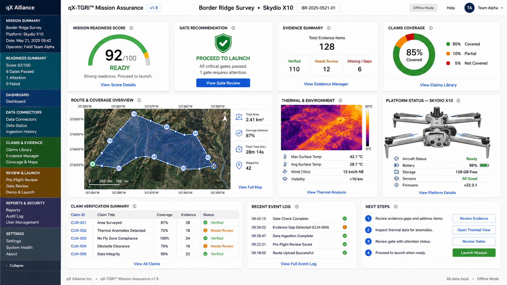

# qx-tgri-reference-model
Reference architecture and trust framework for qX-TGRI™ — a Truth Gap Readiness Index system designed to evaluate evidence integrity, mission assurance, and autonomous decision trustworthiness.
# qX-TGRI™ Reference Model

## Overview

qX-TGRI™ (Truth Gap Readiness Index) is a mission assurance and evidence integrity framework designed to evaluate the trustworthiness, completeness, and operational readiness of autonomous system outputs.

The framework is intended to support:
- AI-enabled mission assurance
- autonomous system trust evaluation
- evidence-chain integrity analysis
- truth-gap identification
- readiness scoring
- operational governance
- machine-verifiable decision receipts

## Core Concepts

qX-TGRI™ evaluates:
- evidence provenance
- claim-to-source alignment
- mission completeness
- trust degradation factors
- autonomous output reliability
- operator accountability pathways

## Intended Applications

Potential applications include:
- UAV and robotics operations
- inspection workflows
- digital twin environments
- AI decision governance
- critical infrastructure systems
- mission auditability
- trusted autonomy ecosystems

## Status

Reference architecture and conceptual framework repository.

Additional implementation details, APIs, scoring models, and integration pathways may be developed in future releases.

## Repository Structure

- `/images` — architecture diagrams and system visuals
- `/docs` — conceptual and technical documentation
- `/examples` — sample trust artifacts and mission receipts
- `/schemas` — interoperability and future data structures

## Intellectual Property Notice

All rights reserved unless otherwise expressly licensed.

Certain concepts, architectures, workflows, and trust methodologies may be subject to pending patent protection, continuation filings, trade secret protection, or other intellectual property rights held by BEYONDx Advisors, LLC and/or associated inventors.

No license is granted by publication of this repository except where expressly stated.

## Sample Mission Receipt

```json
{
  "mission_receipt_id": "QXTGRI-MR-2026-000184",
  "mission_id": "MISSION-ALPHA-7821",
  "timestamp_utc": "2026-05-25T20:14:33Z",
  "system": {
    "platform": "UAV Autonomous Inspection System",
    "vehicle_id": "UAV-X10-442",
    "operator": "BEYONDx Advisors LLC"
  },
  "mission_summary": {
    "mission_type": "Infrastructure Inspection",
    "location": "Critical Infrastructure Zone 4",
    "duration_minutes": 42,
    "autonomy_level": "Supervised Autonomy"
  },
  "readiness_scoring": {
    "integrity_score": 93,
    "assurance_score": 89,
    "operational_readiness_index": 92,
    "readiness_status": "MISSION READY"
  },
  "trust_outputs": {
    "machine_verifiable": true,
    "audit_ready": true,
    "human_review_required": false
  }
}
```
## Mission Assurance Dashboard Concept

The following dashboard mockup illustrates how qX-TGRI™ outputs may be presented for operational review, including mission readiness scoring, gate recommendation, evidence summary, claims coverage, route and coverage overview, thermal and environmental analysis, platform status, and next-step decision support.


